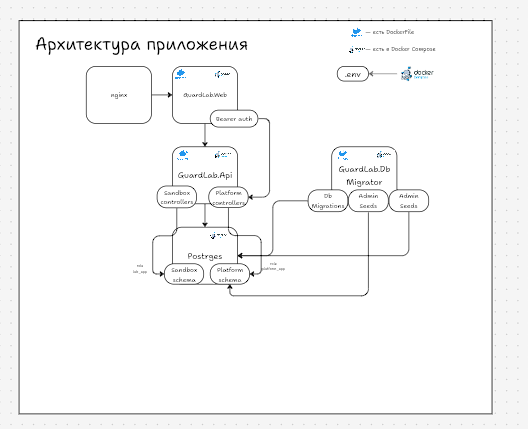
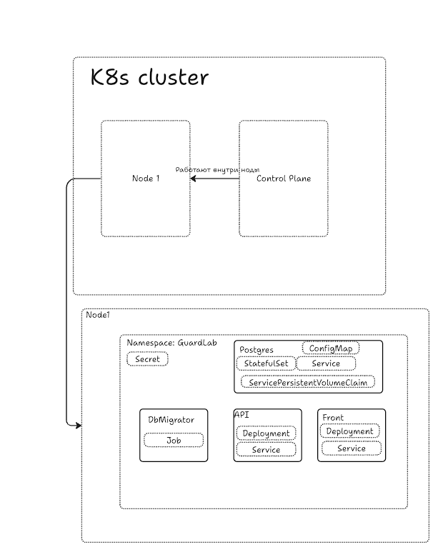

# Отчёт по проекту GuardLab

## 1. Доменная область

GuardLab - учебное веб-приложение для изучения безопасности REST API. Пользователь открывает опубликованную лабораторию, отправляет разрешённые параметры учебного сценария и сравнивает ответы уязвимой и защищённой реализаций.

Основной сценарий MVP - IDOR для доступа к API-ключу. В песочнице используются только искуственные данные Alice и Bob. Уязвимая реализация ищет ключ только по идентификатору, а защищённая дополнительно проверяет владельца ключа относительно учебной сессии.

Администратор управляет содержимым лабораторий: создаёт черновики, редактирует их, публикует, архивирует, восстанавливает и проверяет IDOR-сценарий через preview до публикации.

## 2. Стек реализации

- Backend: C# и ASP.NET Core Web API на .NET 10
- Frontend: React, TypeScript и Vite
- Взаимодействие: HTTP/1.1 REST
- БД: PostgreSQL
- Доступ к данным: Entity Framework Core и Npgsql
- Аутентификация администратора: JWT Bearer с ролью admin
- раздача frontend: Nginx
- Локальный запуск: Docker Compose
- Запуск в Kubernetes: minikube
- Логирование: Microsoft.Extensions.Logging, stdout/stderr

## 3. Основные сущности

### Lab

Лаборатория содержит Id, Slug, заголовок, краткое описание, теорию и статус жизненного цикла:

- Draft - черновик;
- Published - доступна в публичном каталоге;
- Archived - логически архивирована.

### AdminUser

Администратор содержит email, хеш пароля и роль. Пароль не возвращается API и не записывается в логи. Успешный вход выдаёт короткоживущий JWT

### SandboxAccount и SandboxApiKey

Учебные сущности песочницы. Ключ принадлежит аккаунту Alice или Bob и содержит только фиктивные метаданные с trainingOnly.
Песочница находится в отдельной схеме PostgreSQL и используется IDOR-сценарием + сделаны роли, чтобы нельзя было засчёт уязвимостей достать до реальных данных

## 4. CRUD и REST API

Публичные ручки:

- `GET /api/labs` - список опубликованных лабораторий
- `GET /api/labs/{slug}` - данные опубликованной лаборатории
- `POST /api/labs/{slug}/run` - запуск разрешённого учебного сценария
- `GET /api/health` - состояние API и подключения к базе

Админские ручки (авторизация через JWT):

- `POST /api/auth/login` - вход админа
- `GET /api/admin/labs` и `GET /api/admin/labs/{id}` - чтение
- `POST /api/admin/labs` - создание
- `PUT /api/admin/labs/{id}` - изменение
- `POST /api/admin/labs/{id}/run` - preview
- `POST /api/admin/labs/{id}/archive` - архивирование
- `POST /api/admin/labs/{id}/restore` - восстановление в Draft

## 5. Соответствие 12 факторам

### 1. Codebase

Одна кодовая база находится в одном репозитории.
Backend, frontend, инфраструктурные SQL-файлы, Dockerfile, Compose и документация. 
Под разные площадки развертывание через одну кодовую базу

### 2. Dependencies

Зависимости backend объявлены в csproj, frontend - в ackage.json и package-lock.json

### 3. Config

Пароли PostgreSQL, connection strings, JWT signing key и admin credentials передаются через переменные окружения Compose 
или User Secrets при локальном запуске. В репозитории хранится только .env.example

### 4. Backing services

PostgreSQL используется как подключаемый сервис.API получает адрес и credentials через конфигурацию

### 5. Build, release, run

Этапы разделены: Dockerfile восстанавливает зависимости и собирает приложение, 
Compose передаёт конфигурацию окружения и запускает контейнеры.
GuardLab.DbMigrator собирается в отдельный одноразовый контейнер db-init

### 6. Processes

API не хранит постоянное состояние пользователя в памяти процесса. 
Лаборатории и учебные данные находятся в PostgreSQL, frontend хранит admin token только в session storage браузера

### 7. Port binding

API самостоятельно экспортирует HTTP через Kestrel на порту контейнера 8080.
Web-контейнер экспортирует Nginx на 80 и публикует его на localhost:8080. 
Локальный frontend запускается Vite на отдельном порту и проксирует /api.

### 8. Concurrency

API не хранит важные данные в памяти одного запущенного процесса. 
Все лаборатории и другие постоянные данные находятся в PostgreSQL. Поэтому можно запустить несколько копий API,
а отдельный сервер перед ними будет распределять запросы между этими копиями. Каждый запрос будет обработан одинаково
### 9. Disposability

Контейнеры запускаются и останавливаются стандартными командами Compose. HTTP-методы асинхронны,
отмена передаётся через CancellationToken а результат не зависит от предыдущего процесса API.
Для длительных фоновых задач отдельный worker пока не нужен в пределах MVP.

### 10. Dev/prod parity

Локальный и Compose-запуски используют тот же PostgreSQL и тот же ASP.NET Core API.
Отличаются только конфигурацией: локально применяются User Secrets и Vite, в Compose - переменные окружения

### 11. Logs

API использует `ILogger<T>` и JSON Console Provider. 
Логи направляются в stdout/stderr. Middleware записывает HTTP-метод, путь, статус, длительность и traceId

### 12. Admin processes

Bootstrap ролей PostgreSQL выполняется штатным init-скриптом PostgreSQL при создании volume. Миграции EF Core и seed выполняются через GuardLab.DbMigrator

## 6. Использованные абстракции Kubernetes

Приложение разворачивается в локальном однонодовом кластере minikube в namespace guardlab

- Namespace guardlab - изолирует ресурсы приложения от остальных ресурсов кластера
- Secret guardlab-secrets хранит секреты для .env. Секреты передаются в контейнеры через переменные окружения
- ConfigMap pg-init содержит SQL-скрипт первоначальной инициализации PostgreSQL(скрипт уйдет в `/docker-entrypoint-initdb.d/`)
- StatefulSet postgres запускает постгрю с одной репликой и Для базы используется PV
- PersistentVolumeClaim создаётся через volumeClaimTemplates StatefulSet и сохраняет данные постгри при пересоздании Pod
- Service postgres - ClusterIP - получаем ip только внутри кластера и порт `5432` для подключения приложений к базе
- Job db-migrator запускает GuardLab.DbMigrator один раз. Его init-контейнер ждёт пока постгря будет готова, после чего выполняются миграции
- Deployment guardlab-api управляет репликами апи
- Service api - ClusterIP предоставляет внутренний ip апи для Webа. API не публикуется напрямую наружу
- Deployment guardlab-web управляет репликами frontend-контейнера с Nginx
- Service guardlab-web - NodePort - публикует frontend за пределами кластера, чтобы открыть в браузере
- Readiness и liveness probes проверяют готовность и работоспособность постгри и апи. Readiness не дает service проксировать запросы в неготовый под, а liveness позволяет куберу перезапустить контейнер, с которым что-то не то пошло

## 7. Взаимодействие сервисов приложения

После запуска k8s создаёт внутренние днс-имена для Service => компоненты обращаются друг к другу по именам Service (и даже если ip поменяются, они будут знать как найти друг друга)

1. PostgreSQL - StatefulSet postgres и доступен внутри namespace по адресу postgres:5432
2. DbMigrato подключается к postgres:5432 под ролью db_owner - сначала init-контейнер проверяет выполнение `SELECT 1`, затем контейнер применяет миграции
3. API подключается к тому же Service postgres, но использует роли `platform_app` и `lab_app`, а строки подкл. для бд передаются через Secret
4. Фронт получает запросы браузера через Service guardlab-web - NodePort. Статические файлы frontend отдаёт Nginx
5. Запросы браузера к /api/ Nginx проксирует на Service api по адресу `http://api:8080/api/`. Service распределяет запросы между подами апи
6. апи обрабатывает запрос, обращается к постгре через ClusterIP Service и возвращает результат через апи Service и Nginx в браузер

7. 
## 8. Ограничения MVP

В проекте пока нет пользовательских аккаунтов студентов, истории попыток, refresh token, MFA и произвольного исполнения кода или SQL.
IDOR-обработчик ограничен фиксированным учебным сценарием и тестовыми данными. Дальше буду развивать данные сценарии.
